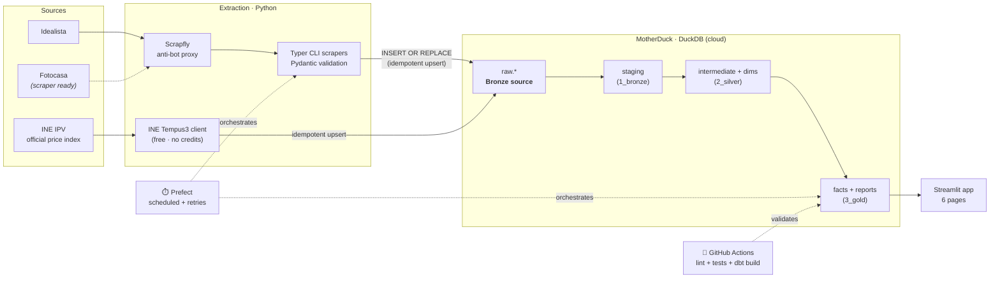

# 🏘️ Spanish Housing Radar

### Is this flat expensive? No portal will tell you. This does.

Spanish property portals show you a price. They never show you whether it is a **good** price.
"€225,000 for 120 m² in Patraix" is a number with nothing to compare it against — and the only
answer that means anything is *what are the other flats in Patraix asking per square metre?*
No portal shows you that, because no portal is in the business of telling you a flat is overpriced.

**Spanish Housing Radar builds that comparison and scores every flat 0–100 against its own
neighbourhood** — so the question stops being "can I afford this?" and becomes "is this a deal?"

---

### What that actually looks like

> In August 2026, among the flats on the market in València, the pipeline surfaced this one:
>
> **120 m² in Patraix — €225,000.**
> That is **€1,875/m²**, against a **€2,865/m²** median for the other flats in the same barrio.
> **34.6% below its own neighbourhood**, measured against 9 comparable listings.
> **Score: 80 / 100.**
>
> On a portal, that flat is "€225,000" — indistinguishable from an overpriced one two streets away.
> Here it is the highest-scoring flat in the city among those measured against their own barrio,
> and you can see the arithmetic that says so.

<p align="center">
  <a href="https://spanish-housing-radar-carlosdmv7.streamlit.app/"><b>▶ Try it live</b></a>
  &nbsp;·&nbsp;
  <a href="https://carlosdmv7.github.io/spanish-housing-radar/">Data lineage &amp; tests</a>
</p>

<p align="center">
  
  
  
  <a href="https://github.com/carlosdmv7/spanish-housing-radar/actions/workflows/ci.yml">
    </a>
</p>

<p align="center"><sub>Those three numbers are read live from
<a href="docs/status.json"><code>docs/status.json</code></a>, which the pipeline rewrites on every
run — the same file the app itself reads. They cannot go stale without this README saying so.</sub></p>


---

## What you can ask it

| | |
|---|---|
| **Which flats are underpriced right now?** | Every listing scored against comparable flats in its own barrio, ranked, on a map. |
| **What does a m² cost here?** | The €/m² benchmark per neighbourhood — the number the score is measured against — next to the official INE index of what buyers actually paid. |
| **Can I afford this?** | Not just the instalment: the transfer tax and fees due in cash on signing day, what the bank's tie-in products are really worth, and whether renting and investing the difference beats buying. |
| **Who can afford to live here?** | What each barrio demands of *your* income — and, using official INE household income, what it demands of the people already living in it. |
| **How does it work, and what can it not tell me?** | The arithmetic, the data's provenance, and the questions it honestly cannot answer. |

<details>
<summary>📸 More screenshots</summary>


</details>

---

## What it refuses to pretend

Most of the engineering here went into *not* overclaiming, because a housing tool that sounds
confident is easy and a housing tool you can trust is not.

- **These are asking prices, not sale prices.** What a seller wants is not what a flat is worth.
  The official INE transaction index sits on the Market page as the counterweight, labelled with
  the quarter it describes and how old that quarter is — currently four behind, and the app says so
  rather than letting a year-old figure read as today's.
- **A score is only as good as what it was compared against.** A flat measured against 9 neighbours
  and a flat measured against the whole city are not the same claim, so **every** score on every
  screen shows which one it got and how many comparables backed it.
- **Thin data is shown, flagged — never quietly dropped.** Dropping sparse neighbourhoods would make
  the coverage look complete while lying about it.
- **It tells you a price is unusual for its market. Nothing more.** It has never seen the flat: not
  the condition, the floor, the light, the noise or the works it needs. That is where a search should
  *start*, not end.

---

---

# How it's built

Everything above is the product. Everything below is the engineering, for whoever wants it — a
deliberate showcase of a **modern, governed data stack**: the same problems I solve professionally
(reliable ELT, trusted metrics, a single source of truth), built in the open and reproducible from
a clean clone in three commands.

<p align="center">
  
  
  
  
  
  
  
  
</p>

## Architecture



**Legend:** solid = core data flow · dashed = orchestration/validation layers wrapping it.

| Layer | Tech | Role |
|---|---|---|
| **Ingestion** | Python · BeautifulSoup · Scrapfly · Pydantic · Typer | Robust scraping behind an anti-bot proxy; schema-validated; idempotent loads |
| **Market context** | INE Tempus3 JSON API | Free, keyless feed of the official house-price index (IPV) — grounds asking prices against transaction-based reality; runs even while scraping is parked |
| **Warehouse** | MotherDuck (DuckDB in the cloud) | Cheap, serverless, zero-ops analytical store |
| **Transformation** | dbt Core (Medallion: bronze → silver → gold) | Tested, documented, lineage-tracked SQL models |
| **Orchestration** | Prefect | `extract → dbt build` flow with task-level retries + structured logging, triggered weekly by a GitHub Actions cron (`.github/workflows/pipeline.yml`) |
| **CI/CD** | GitHub Actions | Ruff + pytest + `dbt build` against an isolated `ci_*` schema on every PR (`.github/workflows/ci.yml`) |
| **Serving** | Streamlit · Altair · pydeck | 6-page interactive analytical app; charts inherit one brand theme, no CSS injection |

---

## The Opportunity Score

**In one sentence:** a flat's price per m² is compared against what comparable flats in the same
area are asking, and the further below that it sits, the higher it scores. 50 means "exactly
average for the area". 100 means "far cheaper than anything comparable".

The reason it is a z-score and not simply "% below the median" is that a 10% discount means
something very different in a uniform barrio than in one where prices are all over the place.
Dividing by the spread makes two neighbourhoods comparable. In algebra:

```text
z_score   = (price_per_sqm − benchmark_median_ppsqm) / benchmark_stddev_ppsqm
z_clamped = clamp(z_score, −3, +3)
score     = clamp(50 − z_clamped × (50/3), 0, 100)
```

| Score | Meaning | Deal tier |
|---|---|---|
| **100** | far below market | `great_deal` (≥75) |
| **50** | exactly at the median | `good_deal` (≥55) · `fair` (≥45) |
| **0** | far above market | `overpriced` (≥25) · `very_overpriced` |

**Hierarchical benchmark.** Spanish listings are sparse at the neighbourhood level, so comparing a
flat only against its own barrio would mean comparing it against itself (z-score 0 → a meaningless
"fair" 50). Instead the score picks the **finest grain with enough comparables**: neighbourhood →
district → **city**, controlled by `min_comps_for_benchmark` (default 8). Each row records which grain
scored it (`benchmark_level`), and the app shows it ("scored vs city"). Only rows that fall back to a
thin city grain are flagged `low_confidence` and **surfaced with a warning rather than dropped**.

---

## dbt models (lineage)

```
1_bronze   stg_idealista__listings · stg_fotocasa__listings        (sources + light typing)
           stg_ine__hpi · stg_ine__income                          (the two official feeds)
2_silver   int_listings_unioned → int_listings_current             (latest snapshot per listing)
                                 → int_listings_history             (all snapshots, for trends)
           int_neighborhood_stats · dim_neighborhoods              (benchmarks + dimension)
           int_listing_lifecycle                                   (days-on-market, price cuts)
           int_market_context · int_district_income                (INE, resolved to joinable grains)
3_gold     fct_listings_scored                                     (the scoring fact table)
           rpt_opportunities                                       (consumption view for the app)
           rpt_market_context · rpt_district_affordability         (market direction + income)
```

Every model carries a **grain declaration**, column descriptions, and tests
(`unique`, `not_null`, `accepted_values`, `dbt_utils.accepted_range`) so the warehouse fails
loudly when an assumption breaks. See [`transform/models/`](transform/models/).

---

## The app

Six pages, listed at the top of this README. Two things about all of them:

Every page carries a **freshness header** — last ingest, row counts, share of scores computed at
barrio grain, dbt test results — so a visitor sees the data's condition before reading any figure.
Colour comes only from native theme keys and a registered Altair theme; there is no CSS injection
anywhere, so a Streamlit upgrade can't silently break the look.

---

## Key engineering decisions & trade-offs

- **MotherDuck/DuckDB as the warehouse.** A pragmatic call for the project's scale, not a technical
  moat: at thousands-of-rows volume, a serverless DuckDB warehouse is free, zero-ops and fast, while
  Snowflake/BigQuery/Redshift would add cost and operational overhead for no analytical benefit here.
  Crucially the dbt project is **warehouse-agnostic** — it's the same `ref()`/`source()` SQL I'd run
  on Snowflake at work, portable with just a profile swap, so the modelling skills transfer 1:1.
- **Idempotent upserts (`INSERT OR REPLACE`, PK `(source_name, source_id)`).** Re-running an
  extraction never duplicates rows, so the pipeline is safe to retry — a prerequisite for scheduled
  orchestration.
- **Search-card scraping over detail-page scraping.** 25 Scrapfly credits buy ~30 listings from a search page, against one listing from a detail page — ~30× cheaper per listing. (An earlier version of this claimed ~1 credit per search page; that was never measured and is wrong — Idealista requires Scrapfly's anti-bot protection, billed flat at 25.) Detail pages cost 25–29 with
  JS rendering. The trade-off: no per-listing coordinates (see limitations). For a benchmark engine,
  breadth of comparables matters more than per-listing depth.
- **Low-confidence data is shown, not hidden.** Dropping sparse neighbourhoods would make the app
  look complete while quietly lying about coverage. Flagging is the honest default.
- **A benchmark with no dispersion scores neutral, not extreme.** When a cell holds a single
  comparable the standard deviation is 0, and letting the clamp absorb that would snap the z-score
  to −3 → **score 100 → "great deal"** — the pipeline's most confident verdict from its least
  evidence. The z-score is coalesced to 0 (score 50) instead.
- **Snapshot history as a first-class table.** `int_listings_history` keeps every observation so
  price-evolution is real (accumulated one scrape at a time) rather than reconstructed.
- **Per-table source freshness, not one global threshold.** The INE feed is production-critical and
  fails CI after 10 days of staleness; the metered listings table warns without failing, because its
  staleness is a recorded decision rather than a fault. One global threshold would have forced a
  choice between a permanently red build and no freshness gate at all.
- **Load freshness and data freshness are different questions, so they are different checks.**
  `dbt source freshness` measures `_loaded_at`, and the INE loader rewrites every row each week —
  so that gate returns a green PASS however old the index inside the table is, and it did, for a
  year. It catches a cron that died and nothing else. `assert_ine_hpi_period_is_current` watches
  `period_date` instead and **warns** when the newest quarter falls further behind than a
  publication gap explains. Warn, not error: whether the IPV advances is INE's business, and a red
  build would assert a fault in code that is working correctly.

### Key decisions (ADRs)

Each of these is written up as an **[Architecture Decision Record](docs/adr/)** — the context, the
call, the consequences I now have to live with (including the ones that constrain the app's UI),
and the alternatives I rejected and why.

| ADR | Decision | The cost I accepted |
|---|---|---|
| [0001](docs/adr/0001-search-card-scraping.md) | Scrape **search cards**, not detail pages | ~30 listings per 25-credit request instead of one — but **no per-listing coordinates**, so the map plots barrio centroids |
| [0002](docs/adr/0002-warehouse-motherduck-medallion.md) | MotherDuck (DuckDB) warehouse with a dbt medallion | Free and zero-ops at this scale; free-tier limits are a real ceiling |
| [0003](docs/adr/0003-idempotent-upserts.md) | Idempotent upserts keyed on `(source_name, source_id)` | Retry-safe, but a re-scrape overwrites the prior observation — history has to live in silver |
| [0004](docs/adr/0004-hierarchical-benchmark-grain.md) | Hierarchical benchmark grain: neighbourhood → district → city, `min_comps_for_benchmark = 8` | Grain is **per row**, so `benchmark_level` is a visible gold column the app must always show — a score without its grain isn't interpretable |
| [0005](docs/adr/0005-show-low-confidence-rows.md) | Show low-confidence rows, flagged, rather than dropping them | Some visible scores are genuinely weak; disclosure becomes a presentation responsibility |
| [0006](docs/adr/0006-zero-dispersion-neutral-zscore.md) | Zero dispersion → **neutral z-score (0)**, not a ±3 snap | A one-comparable benchmark would otherwise fabricate a `great_deal`; the cost is that a score of 50 is ambiguous without its comparable count |
| [0007](docs/adr/0007-repair-location-in-silver-not-extraction.md) | Repair scraped locations **in silver**, with the seed outranking the pattern | Makes every parser fix retroactive and stops streets becoming benchmarks; the cost is that the seed is now load-bearing while covering only five cities |
| [0008](docs/adr/0008-district-income-as-the-missing-denominator.md) | Ground prices in **district income** from INE's ADRH, via bulk CSV | Answers *is this area cheap?* rather than only *is this cheap for the area?*; the cost is a ~2-year lag and València-only district coverage |

---

## Run it locally

Dependencies are managed with [**uv**](https://docs.astral.sh/uv/) (`pyproject.toml` +
`uv.lock`). Install it once with `curl -LsSf https://astral.sh/uv/install.sh | sh`, then:

```bash
make install        # uv sync (creates .venv from the lockfile) + config templates
# edit .env  → MOTHERDUCK_TOKEN, SCRAPFLY_API_KEY
make dbt-deps        # install dbt packages (once)

make extract CITY=valencia OP=sale     # 25 Scrapfly credits per page of ~30 listings
make ingest-ine                         # free: official INE house-price index → raw.ine_hpi
make ingest-ine-income                  # free: official INE district household income (annual)
make transform                          # dbt run: bronze → silver → gold
make dbt-test                           # data-quality tests
make app                                # Streamlit on :8501

make pipeline-prefect                   # same extract → dbt build, run as a Prefect flow
```

**Or with Docker** (no local Python needed):

```bash
make docker-build                       # build the pipeline image
make docker-run                         # extract → dbt build inside the container
```

Full command list: `make help`.

Branching, commit conventions and how data changes reach production:
**[CONTRIBUTING.md](CONTRIBUTING.md)**.

### What a scheduled run costs

Worth stating plainly, because it is the constraint that shapes the whole project. Scrapfly bills a
**flat 25 credits per search page** — Idealista requires its anti-bot protection, and that price does
not move — so the free allowance of 1,000 credits a month is exactly **40 pages**.

That arithmetic is why the scheduled scrape is scoped rather than broad. Four pages of València sale
plus four of rent is 200 credits a run, ~800 a month. One page each across ten cities would cost the
same and buy city-level fallbacks nobody can act on; depth in one city is what produces barrio-level
benchmarks, which is the only grain the score is actually worth reading at.

| Repo variable | Default | What it does |
|---|---|---|
| `SCRAPFLY_ENABLED` | `false` | Listing scrape runs only when `true`. With it off, the weekly run still refreshes the free INE feeds and rebuilds dbt, so the warehouse and the app stay live at zero cost. |
| `SCRAPE_CITIES` | `valencia` | Comma-separated. Each city multiplies the credit cost. |
| `SCRAPE_OPERATIONS` | `sale,rent` | Each operation is a separate scraper process. |
| `IDEALISTA_MAX_SEARCH_PAGES` | `4` | Pages per city × operation. 1 page ≈ 30 listings ≈ 25 credits. |
| `SCRAPFLY_CREDIT_BUDGET` | `125` | Hard ceiling **per process**, so a misconfiguration stops itself rather than emptying the month. |

---

## Roadmap

- [x] **Prefect** flow orchestrating `extract → dbt build`, with task-level retries
- [x] **GitHub Actions** CI: lint + `pytest` + `dbt build` on every PR; weekly scheduled pipeline run
- [x] `pytest` unit tests for the `_parse_location()` heuristic, orchestration flow, and mortgage math
- [x] **Hierarchical opportunity score** (neighbourhood → district → city fallback) so the score is
      meaningful even where a barrio is sparse
- [x] **Offline geocoding** of Valencia barrios (seed of canonical names + centroids) → the map works
- [x] `int_listings_unioned` as the multi-source spine with cross-source dedup wired in
- [x] **Dockerised** pipeline (`make docker-build && make docker-run`) — image build verified in CI
- [x] **`dbt docs` on GitHub Pages** — lineage graph, column docs and tests, auto-published on merge
- [x] **dbt contract** enforced on `rpt_opportunities` (the app's de-facto API) + **exposure** for the Streamlit dashboard
- [x] Barrio centroids for **Valencia, Madrid, Barcelona, Sevilla, Málaga** (~170 canonical barrios + aliases)
- [x] **Behavioural deal signals** — `int_listing_lifecycle` derives days-on-market,
      price-cut count and cumulative price change from the snapshot history, surfaced as a
      "motivated seller" filter/badge (a stronger negotiability signal than €/m² alone)
- [x] **Official market context** — free INE house-price-index (IPV) feed (`raw.ine_hpi` →
      `int_market_context` → `rpt_market_context`), grounding scraped asking prices against
      transaction-based reality and keeping the app fresh with zero scraping credits
- [x] **Data-trust surface** — freshness header on every page, per-listing score provenance
      (benchmark grain + comparable count shown wherever a score is), a "How it works & data
      quality" page, and `dbt source freshness` gating CI per source table
- [ ] Ingest **Fotocasa** (`raw.fotocasa_listings`) — staging + union are ready, only the source feed is missing
- [ ] Barrio centroids for Zaragoza / Valladolid / Bilbao

## Known limitations

1. **Data volume is still growing.** Most listings currently benchmark against the **city** grain
   (`benchmark_level`); barrios flip to local benchmarks as they accumulate ≥ 8 comparables. The fix
   is sustained scraping, not lowering the threshold.
2. **Geocoding is barrio-centroid level** (Valencia, Madrid, Barcelona, Sevilla, Málaga) — listings
   plot at their neighbourhood's centroid, not their exact address (search-card scraping doesn't
   expose per-listing coordinates). Zaragoza/Valladolid/Bilbao have no centroids yet.
3. **Fotocasa** scraper and staging exist but `raw.fotocasa_listings` isn't fed yet.
4. **Price-evolution charts and behavioural signals** (`int_listing_lifecycle`: days-on-market,
   price cuts) need several accumulated snapshots to be meaningful. The models are correct from
   day one — a listing seen once reads as "no signal yet" (0), not a fabricated one — and light
   up as the weekly pipeline runs.
5. **INE context is autonomous-community grain**, not per-listing. The IPV is an official
   *regional* transaction-price index (quarterly), so it grounds *market direction* honestly;
   it is deliberately not presented as a per-flat "fair price" (that would be an AVM — future work).
6. **The IPV is currently four quarters behind.** The feed reloads weekly and the newest quarter
   INE has published into it is 2025 Q3. That is a property of the source, not of this pipeline,
   but it is the app's job to say so: the Market page names the reference quarter and its age, and
   `assert_ine_hpi_period_is_current` warns in every build until it advances.

---

<sub>Built by <a href="https://www.linkedin.com/in/carlos-de-manuel">Carlos De Manuel</a> ·
Analytics / Data Engineering portfolio · MIT License</sub>
