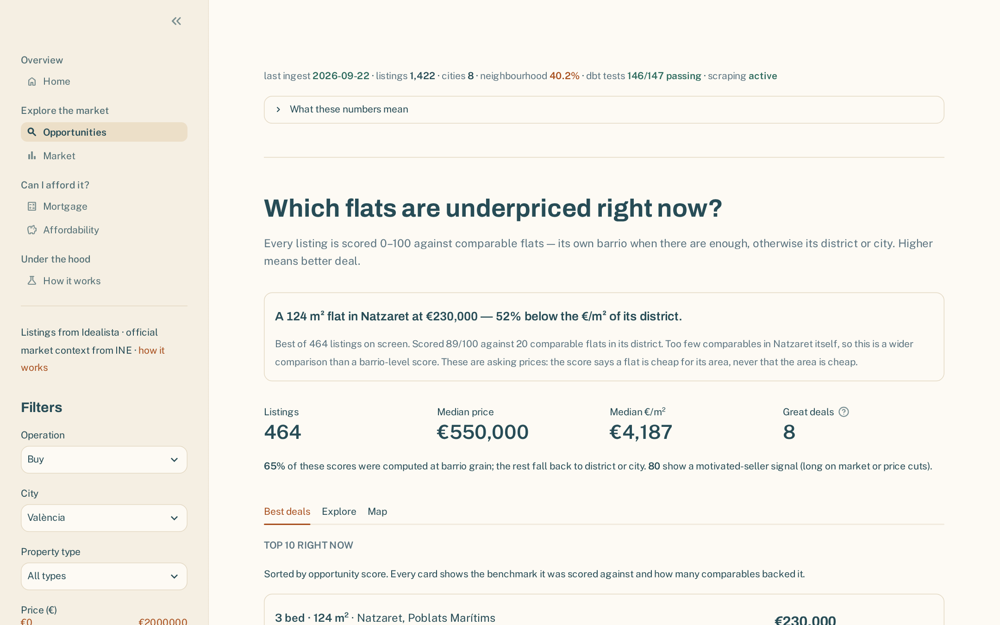
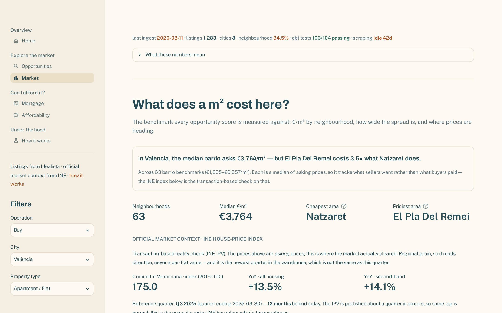
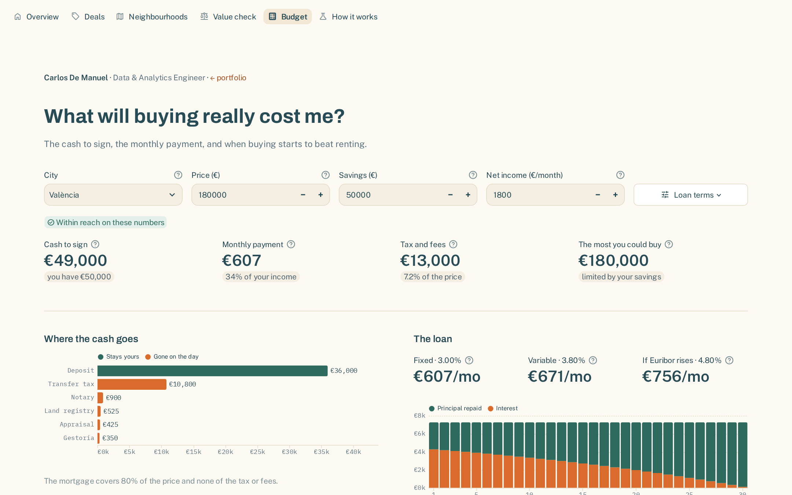
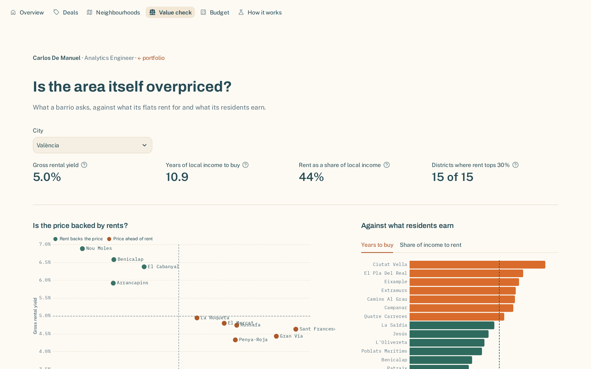
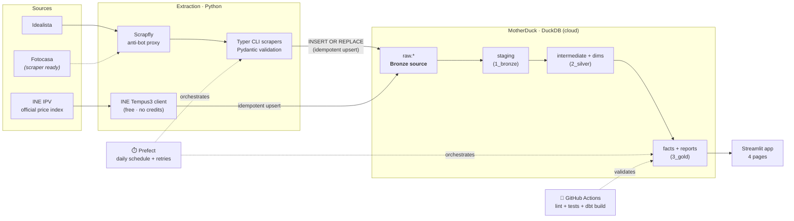

# 🏘️ Spanish Housing Radar

**An end-to-end analytics-engineering pipeline that finds undervalued homes across Spain.**
It scrapes live listings from Idealista, models them through a Medallion (bronze → silver → gold)
dbt project on a cloud warehouse, and serves an **Opportunity Score (0–100)** per listing in an
interactive Streamlit app — surfacing deals priced below their neighbourhood's market rate.

<p align="center">
  <a href="https://github.com/carlosdmv7/spanish-housing-radar/actions/workflows/ci.yml">
    </a>
  
  
  
  
  
  
  
  
</p>

> **🔗 Live demo:** https://spanish-housing-radar-carlosdmv7.streamlit.app/
> **📊 dbt docs (lineage & tests):** https://carlosdmv7.github.io/spanish-housing-radar/
>
> _Listing scraping is paused (Scrapfly credits), but the pipeline is **not** frozen: a
> free, keyless **INE house-price-index** feed refreshes the warehouse on a weekly cron,
> so the app keeps showing current official market context. Listing scraping resumes by
> flipping one repo variable (`SCRAPFLY_ENABLED=true`) when credits return._



<details>
<summary>📸 More screenshots — Market, Mortgage, Affordability</summary>





</details>

---

## Why this project

Spanish housing portals tell you the *price* of a flat, but never whether that price is *good*.
"€280k for 90 m² in this area" means nothing without a benchmark. **Spanish Housing Radar builds
that benchmark from data**: it compares every listing against the live €/m² distribution of its own
neighbourhood and quantifies how much of a deal it is.

It's also a deliberate showcase of a **modern, governed data stack** — the same problems I solve
professionally (reliable ELT, trusted metrics, a single source of truth), built in the open and
fully reproducible.

---

## Architecture



**Legend:** solid = core data flow · dashed = orchestration/validation layers wrapping it.

| Layer | Tech | Role |
|---|---|---|
| **Ingestion** | Python · BeautifulSoup · Scrapfly · Pydantic · Typer | Robust scraping behind an anti-bot proxy; schema-validated; idempotent loads |
| **Market context** | INE Tempus3 JSON API | Free, keyless feed of the official house-price index (IPV) — grounds asking prices against transaction-based reality; runs even while scraping is parked |
| **Warehouse** | MotherDuck (DuckDB in the cloud) | Cheap, serverless, zero-ops analytical store |
| **Transformation** | dbt Core (Medallion: bronze → silver → gold) | Tested, documented, lineage-tracked SQL models |
| **Orchestration** | Prefect | `extract → dbt build` flow with task-level retries + structured logging, triggered daily by a GitHub Actions cron (`.github/workflows/daily_pipeline.yml`) |
| **CI/CD** | GitHub Actions | Ruff + pytest + `dbt build` against an isolated `ci_*` schema on every PR (`.github/workflows/ci.yml`) |
| **Serving** | Streamlit · Plotly · pydeck | 4-page interactive analytical app |

---

## The Opportunity Score

The heart of the product. For each listing we compute its price per m² and compare it to the
**median and standard deviation of comparable listings** (same operation × property type):

```text
z_score   = (price_per_sqm − benchmark_median_ppsqm) / benchmark_stddev_ppsqm
z_clamped = clamp(z_score, −3, +3)
score     = clamp(50 − z_clamped × (50/3), 0, 100)
```

| Score | Meaning | Deal tier |
|---|---|---|
| **100** | far below market | `great_deal` (≥75) |
| **50** | exactly at the median | `good_deal` (≥55) · `fair` (≥45) |
| **0** | far above market | `overpriced` (≥25) · `very_overpriced` |

**Hierarchical benchmark.** Spanish listings are sparse at the neighbourhood level, so comparing a
flat only against its own barrio would mean comparing it against itself (z-score 0 → a meaningless
"fair" 50). Instead the score picks the **finest grain with enough comparables**: neighbourhood →
district → **city**, controlled by `min_comps_for_benchmark` (default 8). Each row records which grain
scored it (`benchmark_level`), and the app shows it ("scored vs city"). Only rows that fall back to a
thin city grain are flagged `low_confidence` and **surfaced with a warning rather than dropped**.

---

## dbt models (lineage)

```
1_bronze   stg_idealista__listings · stg_fotocasa__listings        (sources + light typing)
2_silver   int_listings_unioned → int_listings_current             (latest snapshot per listing)
                                 → int_listings_history             (all snapshots, for trends)
           int_neighborhood_stats · dim_neighborhoods              (benchmarks + dimension)
3_gold     fct_listings_scored                                     (the scoring fact table)
           rpt_opportunities                                       (consumption view for the app)
```

Every model carries a **grain declaration**, column descriptions, and tests
(`unique`, `not_null`, `accepted_values`, `dbt_utils.accepted_range`) so the warehouse fails
loudly when an assumption breaks. See [`transform/models/`](transform/models/).

---

## The Streamlit app

| Page | What it answers |
|---|---|
| **Opportunities** | Where are the under-priced listings right now? Ranked by score, with deal-tier breakdown and map. |
| **Market** | What's the €/m² benchmark by neighbourhood, and how is it evolving? |
| **Mortgage** | Fixed vs variable French-amortisation simulator. |
| **Affordability** | What income does each neighbourhood require? Buy-vs-rent comparison. |

---

## Key engineering decisions & trade-offs

- **MotherDuck/DuckDB as the warehouse.** A pragmatic call for the project's scale, not a technical
  moat: at thousands-of-rows volume, a serverless DuckDB warehouse is free, zero-ops and fast, while
  Snowflake/BigQuery/Redshift would add cost and operational overhead for no analytical benefit here.
  Crucially the dbt project is **warehouse-agnostic** — it's the same `ref()`/`source()` SQL I'd run
  on Snowflake at work, portable with just a profile swap, so the modelling skills transfer 1:1.
- **Idempotent upserts (`INSERT OR REPLACE`, PK `(source_name, source_id)`).** Re-running an
  extraction never duplicates rows, so the pipeline is safe to retry — a prerequisite for scheduled
  orchestration.
- **Search-card scraping over detail-page scraping.** ~1 Scrapfly credit per request vs 25–29 with
  JS rendering. The trade-off: no per-listing coordinates (see limitations). For a benchmark engine,
  breadth of comparables matters more than per-listing depth.
- **Low-confidence data is shown, not hidden.** Dropping sparse neighbourhoods would make the app
  look complete while quietly lying about coverage. Flagging is the honest default.
- **Snapshot history as a first-class table.** `int_listings_history` keeps every observation so
  price-evolution is real (accumulated daily) rather than reconstructed.

---

## Run it locally

Dependencies are managed with [**uv**](https://docs.astral.sh/uv/) (`pyproject.toml` +
`uv.lock`). Install it once with `curl -LsSf https://astral.sh/uv/install.sh | sh`, then:

```bash
make install        # uv sync (creates .venv from the lockfile) + config templates
# edit .env  → MOTHERDUCK_TOKEN, SCRAPFLY_API_KEY
make dbt-deps        # install dbt packages (once)

make extract CITY=valencia OP=sale     # ~1 Scrapfly credit (render_js=false)
make ingest-ine                         # free: official INE house-price index → raw.ine_hpi
make transform                          # dbt run: bronze → silver → gold
make dbt-test                           # data-quality tests
make app                                # Streamlit on :8501

make pipeline-prefect                   # same extract → dbt build, run as a Prefect flow
```

**Or with Docker** (no local Python needed):

```bash
make docker-build                       # build the pipeline image
make docker-run                         # extract → dbt build inside the container
```

Full command list: `make help`.

---

## Roadmap

- [x] **Prefect** flow orchestrating `extract → dbt build`, with task-level retries
- [x] **GitHub Actions** CI: lint + `pytest` + `dbt build` on every PR; daily scheduled pipeline run
- [x] `pytest` unit tests for the `_parse_location()` heuristic, orchestration flow, and mortgage math
- [x] **Hierarchical opportunity score** (neighbourhood → district → city fallback) so the score is
      meaningful even where a barrio is sparse
- [x] **Offline geocoding** of Valencia barrios (seed of canonical names + centroids) → the map works
- [x] `int_listings_unioned` as the multi-source spine with cross-source dedup wired in
- [x] **Dockerised** pipeline (`make docker-build && make docker-run`) — image build verified in CI
- [x] **`dbt docs` on GitHub Pages** — lineage graph, column docs and tests, auto-published on merge
- [x] **dbt contract** enforced on `rpt_opportunities` (the app's de-facto API) + **exposure** for the Streamlit dashboard
- [x] Barrio centroids for **Valencia, Madrid, Barcelona, Sevilla, Málaga** (~170 canonical barrios + aliases)
- [x] **Behavioural deal signals** — `int_listing_lifecycle` derives days-on-market,
      price-cut count and cumulative price change from the snapshot history, surfaced as a
      "motivated seller" filter/badge (a stronger negotiability signal than €/m² alone)
- [x] **Official market context** — free INE house-price-index (IPV) feed (`raw.ine_hpi` →
      `int_market_context` → `rpt_market_context`), grounding scraped asking prices against
      transaction-based reality and keeping the app fresh with zero scraping credits
- [ ] Ingest **Fotocasa** (`raw.fotocasa_listings`) — staging + union are ready, only the source feed is missing
- [ ] Barrio centroids for Zaragoza / Valladolid / Bilbao

## Known limitations

1. **Data volume is still growing.** Most listings currently benchmark against the **city** grain
   (`benchmark_level`); barrios flip to local benchmarks as they accumulate ≥ 8 comparables. The fix
   is sustained scraping + daily runs, not lowering the threshold.
2. **Geocoding is barrio-centroid level** (Valencia, Madrid, Barcelona, Sevilla, Málaga) — listings
   plot at their neighbourhood's centroid, not their exact address (search-card scraping doesn't
   expose per-listing coordinates). Zaragoza/Valladolid/Bilbao have no centroids yet.
3. **Fotocasa** scraper and staging exist but `raw.fotocasa_listings` isn't fed yet.
4. **Price-evolution charts and behavioural signals** (`int_listing_lifecycle`: days-on-market,
   price cuts) need several accumulated snapshots to be meaningful. The models are correct from
   day one — a listing seen once reads as "no signal yet" (0), not a fabricated one — and light
   up as the weekly pipeline runs.
5. **INE context is autonomous-community grain**, not per-listing. The IPV is an official
   *regional* transaction-price index (quarterly), so it grounds *market direction* honestly;
   it is deliberately not presented as a per-flat "fair price" (that would be an AVM — future work).

---

<sub>Built by <a href="https://www.linkedin.com/in/carlos-demanuel">Carlos De Manuel</a> ·
Analytics / Data Engineering portfolio · MIT License</sub>
