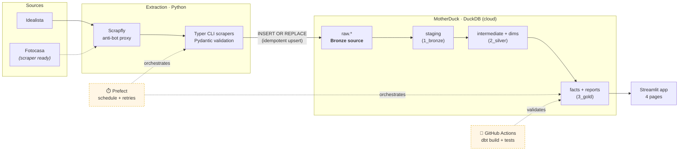

# 🏘️ Spanish Housing Radar

**An end-to-end analytics-engineering pipeline that finds undervalued homes across Spain.**
It scrapes live listings from Idealista, models them through a Medallion (bronze → silver → gold)
dbt project on a cloud warehouse, and serves an **Opportunity Score (0–100)** per listing in an
interactive Streamlit app — surfacing deals priced below their neighbourhood's market rate.

<p align="center">
  
  
  
  
  
  
</p>

> **🔗 Live demo:** _coming soon — deploying to Streamlit Community Cloud_
> **📊 dbt docs (lineage):** _coming soon — publishing to GitHub Pages_

<!-- TODO: replace with a real screenshot / GIF of the Opportunities page once data volume is up -->
<!--  -->

---

## Why this project

Spanish housing portals tell you the *price* of a flat, but never whether that price is *good*.
"€280k for 90 m² in this area" means nothing without a benchmark. **Spanish Housing Radar builds
that benchmark from data**: it compares every listing against the live €/m² distribution of its own
neighbourhood and quantifies how much of a deal it is.

It's also a deliberate showcase of a **modern, governed data stack** — the same problems I solve
professionally (reliable ELT, trusted metrics, a single source of truth), built in the open and
fully reproducible.

---

## Architecture



**Legend:** solid = built & running · dashed = Phase 2 (orchestration & CI, in progress).

| Layer | Tech | Role |
|---|---|---|
| **Ingestion** | Python · BeautifulSoup · Scrapfly · Pydantic · Typer | Robust scraping behind an anti-bot proxy; schema-validated; idempotent loads |
| **Warehouse** | MotherDuck (DuckDB in the cloud) | Cheap, serverless, zero-ops analytical store |
| **Transformation** | dbt Core (Medallion: bronze → silver → gold) | Tested, documented, lineage-tracked SQL models |
| **Orchestration** 🚧 | Prefect | Scheduled daily runs, retries, observability |
| **CI/CD** 🚧 | GitHub Actions | `dbt build` + tests on every push |
| **Serving** | Streamlit · Plotly · pydeck | 4-page interactive analytical app |

---

## The Opportunity Score

The heart of the product. For each listing we compute its price per m² and compare it to the
**median and standard deviation of comparable listings** in the same neighbourhood
(same municipality × operation × property type):

```text
z_score   = (price_per_sqm − neighbourhood_median_ppsqm) / neighbourhood_stddev_ppsqm
z_clamped = clamp(z_score, −3, +3)
score     = clamp(50 − z_clamped × (50/3), 0, 100)
```

| Score | Meaning | Deal tier |
|---|---|---|
| **100** | far below neighbourhood market | `great_deal` (≥75) |
| **50** | exactly at the median | `good_deal` (≥55) · `fair` (≥45) |
| **0** | far above market | `overpriced` (≥25) · `very_overpriced` |

Neighbourhoods with fewer than 10 comparable listings are flagged `low_confidence` and
**surfaced with a warning badge rather than silently dropped** — an honest UX choice while the
dataset grows, instead of hiding sparse-data uncertainty.

---

## dbt models (lineage)

```
1_bronze   stg_idealista__listings · stg_fotocasa__listings        (sources + light typing)
2_silver   int_listings_unioned → int_listings_current             (latest snapshot per listing)
                                 → int_listings_history             (all snapshots, for trends)
           int_neighborhood_stats · dim_neighborhoods              (benchmarks + dimension)
3_gold     fct_listings_scored                                     (the scoring fact table)
           rpt_opportunities                                       (consumption view for the app)
```

Every model carries a **grain declaration**, column descriptions, and tests
(`unique`, `not_null`, `accepted_values`, `dbt_utils.accepted_range`) so the warehouse fails
loudly when an assumption breaks. See [`transform/models/`](transform/models/).

---

## The Streamlit app

| Page | What it answers |
|---|---|
| **Opportunities** | Where are the under-priced listings right now? Ranked by score, with deal-tier breakdown and map. |
| **Market** | What's the €/m² benchmark by neighbourhood, and how is it evolving? |
| **Mortgage** | Fixed vs variable French-amortisation simulator. |
| **Affordability** | What income does each neighbourhood require? Buy-vs-rent comparison. |

---

## Key engineering decisions & trade-offs

- **MotherDuck/DuckDB as the warehouse.** A pragmatic call for the project's scale, not a technical
  moat: at thousands-of-rows volume, a serverless DuckDB warehouse is free, zero-ops and fast, while
  Snowflake/BigQuery/Redshift would add cost and operational overhead for no analytical benefit here.
  Crucially the dbt project is **warehouse-agnostic** — it's the same `ref()`/`source()` SQL I'd run
  on Snowflake at work, portable with just a profile swap, so the modelling skills transfer 1:1.
- **Idempotent upserts (`INSERT OR REPLACE`, PK `(source_name, source_id)`).** Re-running an
  extraction never duplicates rows, so the pipeline is safe to retry — a prerequisite for scheduled
  orchestration.
- **Search-card scraping over detail-page scraping.** ~1 Scrapfly credit per request vs 25–29 with
  JS rendering. The trade-off: no per-listing coordinates (see limitations). For a benchmark engine,
  breadth of comparables matters more than per-listing depth.
- **Low-confidence data is shown, not hidden.** Dropping sparse neighbourhoods would make the app
  look complete while quietly lying about coverage. Flagging is the honest default.
- **Snapshot history as a first-class table.** `int_listings_history` keeps every observation so
  price-evolution is real (accumulated daily) rather than reconstructed.

---

## Run it locally

```bash
make install        # venv + deps + config templates
# edit .env  → MOTHERDUCK_TOKEN, SCRAPFLY_API_KEY
make dbt-deps        # install dbt packages (once)

make extract CITY=valencia OP=sale     # ~1 Scrapfly credit (render_js=false)
make transform                          # dbt run: bronze → silver → gold
make dbt-test                           # data-quality tests
make app                                # Streamlit on :8501
```

Full command list: `make help`.

---

## Roadmap

- [ ] **Prefect** flow orchestrating `extract → dbt build`, scheduled daily with retries
- [ ] **GitHub Actions** CI: `dbt build` + tests on every push; nightly scheduled run
- [ ] **Dockerise** the pipeline for one-command reproducibility
- [ ] Publish **`dbt docs`** (navigable lineage) to GitHub Pages
- [ ] Enrich `dim_neighborhoods` with **lat/lon via offline geocoding** → unlock the map page
- [ ] Wire **Fotocasa** into `int_listings_unioned` for a second source / larger samples
- [ ] dbt **contracts** + **exposures** linking models to app pages
- [ ] `pytest` unit tests for the `_parse_location()` heuristic

## Known limitations

1. **Data volume is still growing.** With a young dataset many neighbourhoods are `low_confidence`;
   the fix is sustained scraping across cities + daily scheduled runs, not lowering the threshold.
2. **`lat`/`lon` are null** until geocoding (roadmap) — the map page degrades gracefully.
3. **Fotocasa** scraper exists but isn't unioned into the models yet.
4. **Price-evolution** charts need several days of accumulated snapshots to be meaningful.

---

<sub>Built by <a href="https://www.linkedin.com/in/carlos-demanuel">Carlos De Manuel</a> ·
Analytics / Data Engineering portfolio · MIT License</sub>
